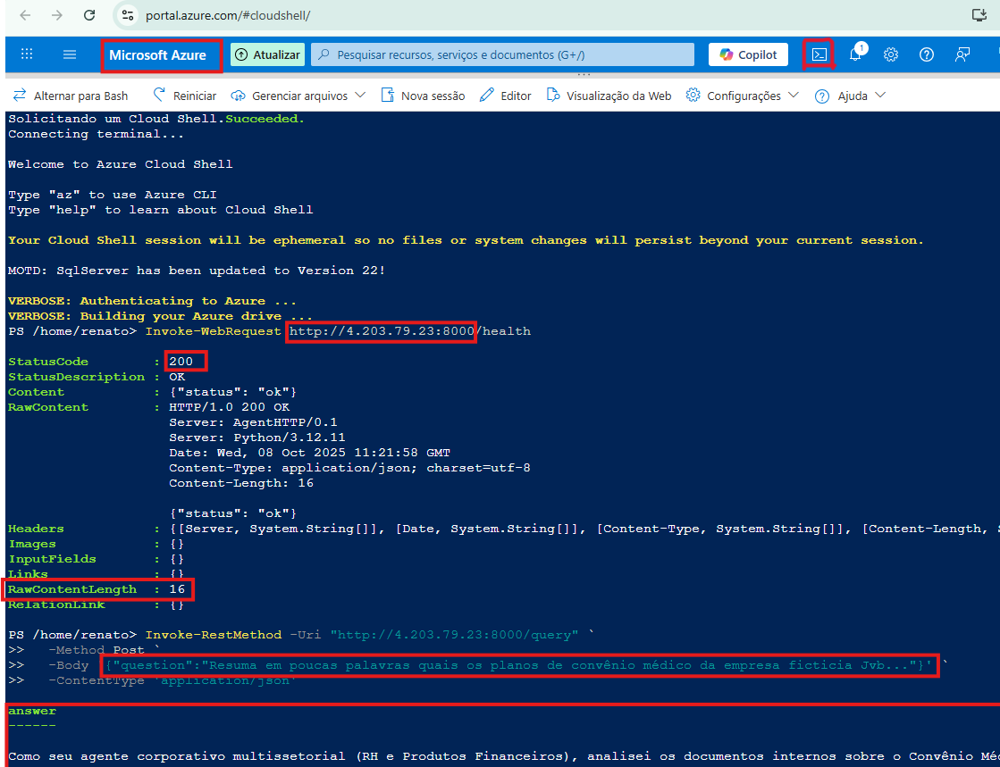

# Azure
Este guia mostra como subir e testar o agente de IA no Azure usando Cloud Shell.

**Criar Resource Group:**
az group create --name agente-ia-gr --location eastus

**Criar ACR:**
az acr create --resource-group agente-ia-gr --name agenteiacontainer --sku Standard

**Criar imagem:**
docker build -t agenteiacontainer.azurecr.io/app:latest .

**Login ACR:**
docker login agenteiacontainer.azurecr.io -u <usuario> -p <senha>

**Push imagem:**
docker push agenteiacontainer.azurecr.io/app:latest

**Criar ACI:**
az container create --resource-group agente-ia-gr --name aci-agente-ia --image agenteiacontainer.azurecr.io/app:latest --registry-login-server agenteiacontainer.azurecr.io --registry-username <usuario> --registry-password <senha> --dns-name-label aci-agente-ia --ports 8000

**Testar saúde:**
Invoke-WebRequest http://<ip-ou-dns>:8000/health

**Testar consulta:**
Invoke-RestMethod -Uri "http://<ip-ou-dns>:8000/query" -Method Post -Body '{"question":"Sua pergunta"}' -ContentType "application/json"